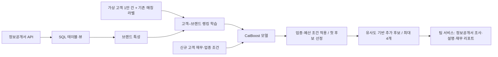

# 창업동행 · 프랜차이즈 브랜드 추천

**LLM이 처리하던 초기 브랜드 매칭을 CatBoost 랭킹 모델과 조건 필터로 전환한 프로젝트입니다.**

기존 초기 매칭에는 약 1~2분이 소요됐습니다. 가상 고객 1만 건으로 학습한 모델을 도입한 뒤 직접 사용·확인한 기준으로 거의 즉시 후보를 반환하도록 개선했습니다. 응답 시간은 초기 매칭 단계의 사용 관찰 기준입니다.

| 항목 | 내용 |
|---|---|
| 기간 | 2026.08–2026.09 |
| 참여 | 2026 금융 AI Challenge · 2인 팀 |
| 담당 | 데이터 수집 요구사항, SQL 기반 모델 입력 가공, CatBoost 모델링, 서비스 기획서 작성 |
| 핵심 기술 | Python · SQL · CatBoostRanker · Pandas · Scikit-learn |
| 팀 서비스 | [창업동행 웹 MVP](https://franchise-finance-agent.streamlit.app/) |

## 1. 왜 만들었나

예비 창업자는 여러 브랜드의 비용·매출·가맹 조건을 자신의 재무 상황에 맞게 비교해야 합니다. 초기 서비스에서는 금융 정보를 LLM API에 전달해 브랜드를 매칭했지만, 응답을 기다리는 시간과 API 호출 비용이 부담이었습니다.

반복되는 후보 선정은 학습 모델이 맡고, 정보공개서 조사와 설명은 LLM이 맡도록 역할을 나눴습니다.

## 2. 내가 한 일과 팀의 결과

- **문제와 접근 결정:** 초기 매칭의 지연을 줄이기 위해 기계학습 기반 추천으로 전환하는 방향을 정했습니다.
- **데이터 준비:** GPT로 가상 고객 1만 건을 생성했습니다. 필요한 수집 항목과 목적을 전달하고 Codex를 활용해 API 수집·SQL 적재 환경을 구성했습니다.
- **모델링:** 고객–브랜드 조합을 구성하고 CatBoost 랭킹 모델과 업종·예산 조건을 결합했습니다.
- **기획:** 대상 고객, 문제 정의, 데이터 활용 및 AI 적용 방안을 담은 서비스 기획서를 작성했습니다.
- **팀 결과:** 추천 후보를 정보공개서 질의응답, 3종 재무 시나리오 및 PDF 리포트에 연결한 웹 MVP를 구현·배포했습니다.

**AI 활용:** API 수집·DB 구성은 요구사항을 바탕으로 Codex를 활용해 구현했고, 가상 고객 생성에는 GPT를 활용했습니다.

## 3. 처리 구조



### 학습

고객 단위로 학습 8,000명과 평가 2,000명을 분리했습니다. 기존 매칭 브랜드를 기준으로 층화 분할하고, 학습 고객마다 매칭 브랜드 1개와 비교 후보 30개를 구성합니다. 비교 후보에는 동일·선호 업종 및 비슷한 브랜드 유형의 후보를 포함합니다.

`CatBoostRanker`의 `YetiRankPairwise`를 사용해 고객별 후보 순위를 학습합니다. 브랜드명·업종·선호 업종 등 범주형 특성과 자금·비용·매출 등 수치형 특성을 함께 입력합니다. 가용 예산, 예산/창업비용 비율, 부채/예산 비율도 특성으로 구성합니다.

### 추천

1. 고유 브랜드 439개의 모델 점수를 계산합니다.
2. 선호 업종 안에서 예산 가능한 브랜드를 우선해 첫 후보를 고릅니다.
3. 추가 후보는 업종·브랜드 유형·비용·매출·점포 수의 유사도로 선정합니다.
4. 선호 업종 후보가 부족하면 무관한 업종으로 4개를 채우지 않습니다. 예산 내 후보가 부족하면 예산 초과 후보를 반환하고 사유를 표시합니다.

모델은 기존 매칭 패턴에 따른 상대적 적합도를 점수화하고, 최종 후보는 조건 필터와 유사도 로직을 결합해 구성합니다.

## 4. 검증 결과

아래는 **전체 가상 고객 1만 건 실험 중 분리한 평가 고객 2,000명**에 최종 추천 조건을 적용한 저장 결과입니다.

| 지표 | 결과 | 의미 |
|---|---:|---|
| 첫 추천의 기존 라벨 일치율 | 57.55% | 첫 후보가 기존 매칭 브랜드와 같은 비율 |
| 최종 후보의 기존 라벨 포함률 | 70.10% | 최대 4개 후보 안에 기존 매칭 브랜드가 포함된 비율 |
| 첫 추천 선호 업종 일치율 | 100% | 정렬된 선호 업종 기준 |
| 첫 추천 예산 적합률 | 84.45% | 모델 코드의 가용 예산 정의 기준 |
| 고객당 평균 추천 수 | 3.428개 | 후보 부족 시 4개 미만 반환 |

초기 매칭 시간은 약 1~2분에서 거의 즉시 처리하는 수준으로 개선됐습니다(직접 사용 시 관찰).

[평가 해석과 데이터 범위](docs/evaluation.md) · [수집·가공 흐름](docs/data-pipeline.md) · [원래 실험 결과](reports/original/evaluation_preference_fixed.json)

## 5. 실행해 보기

Python 3.10 이상에서 다음을 실행합니다.

```bash
python -m venv .venv
# Windows: .venv\Scripts\activate
# macOS/Linux: source .venv/bin/activate
pip install -r requirements.txt

# 공개 샘플로 학습 흐름 확인
python src/brand_recommender.py train --iterations 20

# 학습한 모델로 예시 고객 추천
python src/brand_recommender.py recommend --input data/sample/new_profiles.csv --output outputs/recommendations.csv
```

공개 샘플은 합성 고객 345명, 매칭 라벨 69개 브랜드, 브랜드 카탈로그 439개입니다. 모델 파일은 학습 시 `src/artifacts/`에 생성됩니다. 실행에는 GitHub에 없는 API 키나 DB 접속정보가 필요하지 않습니다.

공개 패키지는 실행 예시용 샘플과 학습·추천 코드로 구성했습니다. 전체 1만 건 실험의 결과는 `reports/original/`에서 확인할 수 있습니다.

## 6. 파일 안내

| 경로 | 설명 |
|---|---|
| `src/brand_recommender.py` | 학습, 조건 적용, 추천, 평가 |
| `data/sample/` | 합성 고객 샘플·브랜드 혼합 데이터·기준 라벨 |
| `docs/data-pipeline.md` | SQL 뷰의 용도와 특성 가공 흐름 |
| `docs/evaluation.md` | 지표 분모·라벨 의미·해석 범위 |
| `reports/original/` | 전체 실험에서 저장한 평가 결과 |

API 수집·SQL 뷰의 구성과 가공 흐름은 `docs/data-pipeline.md`에 정리했습니다. 공개 코드는 모델 학습·추천 모듈을 중심으로 구성했습니다.

## 7. 다음 검증

- 동일 입력으로 LLM 매칭과 모델 추론의 응답 시간·호출 비용 비교
- 예산 초과 후보를 보여주는 방식과 추천 보류 방식 비교
- 독립된 사용자 판단을 이용한 추천 평가와 라벨 편중 점검

데이터는 가상 고객 프로필과 공시·보완 값이 혼합된 브랜드 정보로 구성됩니다. 자세한 출처와 처리 방식은 데이터 문서에 정리했습니다.
